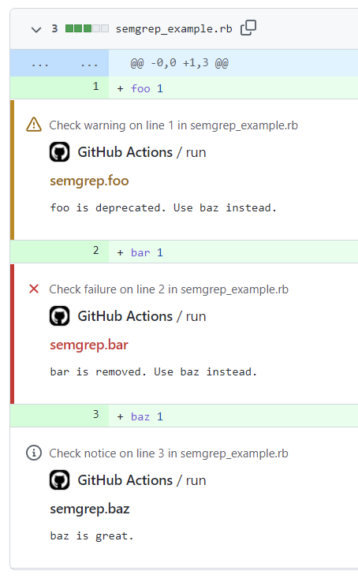

# semgrepper

[Custom action](https://docs.github.com/en//actions/creating-actions/about-custom-actions)
to run [Semgrep](https://github.com/returntocorp/semgrep) and output results in GitHub Annotations format.



## Usage

```yaml
# .github/workflows/semgrep.yml
name: semgrep

on:
  pull_request:
  push:
    branches:
      - main

jobs:
  run:
    runs-on: ubuntu-latest
    steps:
      - uses: actions/checkout@v3
      - uses: r7kamura/semgrepper@v0
```

## Inputs

### `config`

- `--config` option value for `semgrep ci`.
- optional
- default: `.semgrep`
